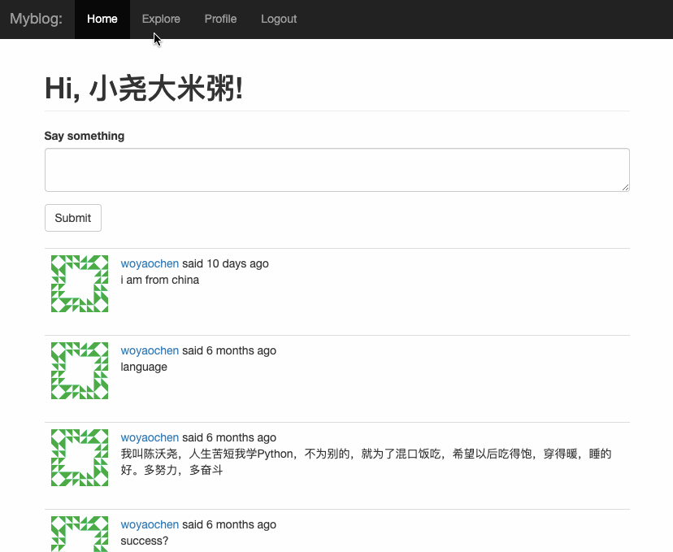

### 博客

<pre>
利用python flask 结合 sqlite 编写的博客程序
参考了microblog的flask_web开发这本书
该项目利用了flak-login用户认证，tokens保护机制
对用户注册，密码重置利用了flask_mail的邮箱确认
页面的布局利用了bootstrap
模板使用了jinjia对html编写
利用了Blueprint对路由函数进行包装	
</pre>