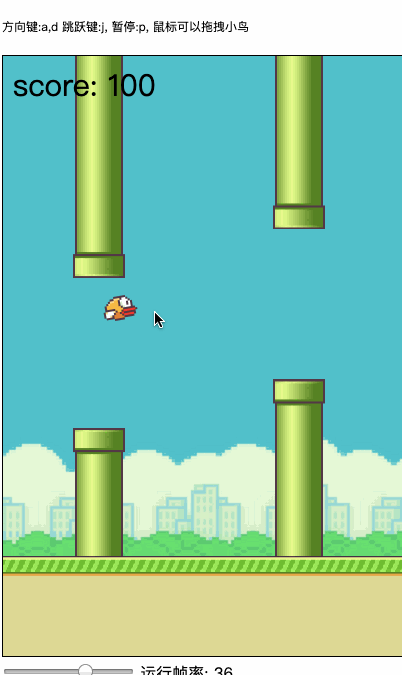
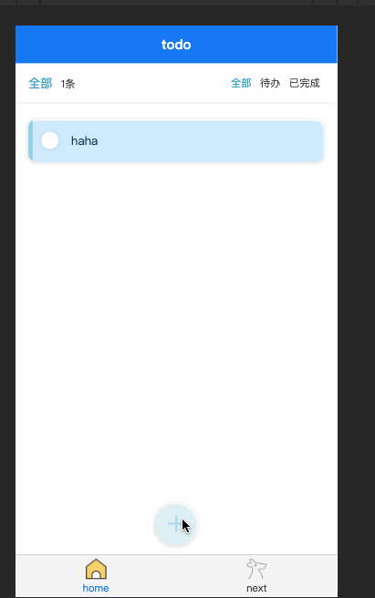
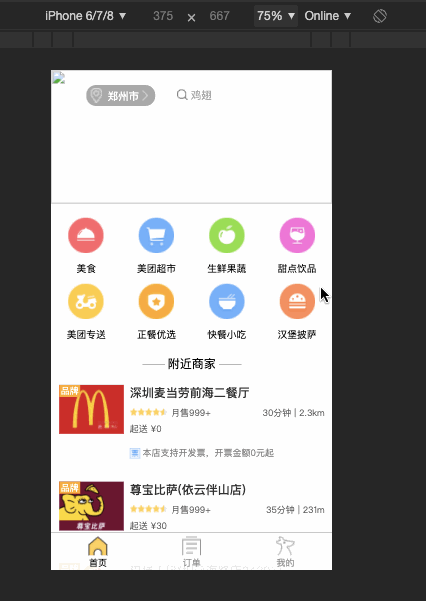
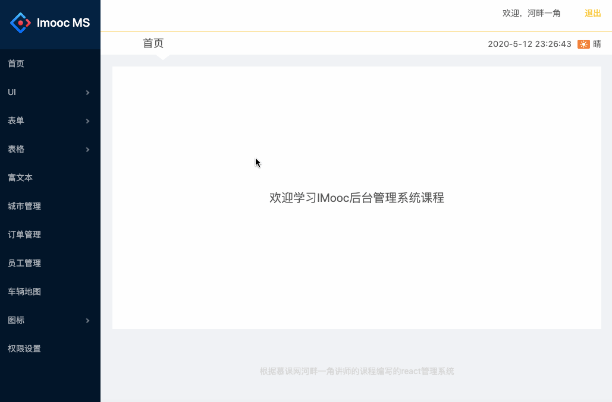
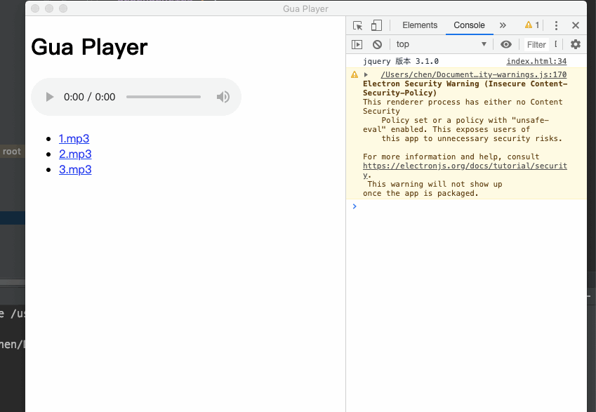

# -我的学习作品

# __学习总结__
### 个人网站
 
<pre>
	docker的代码托管，持续集成和部署.vue,vue-router,vuex,elementUi进行前端的搭建.通过python爬虫mock数据. python flask, mysql编写后端接口.
</pre>

### 商城
			
<pre>
	vuecli搭建页面，vue构建header,seller,
	shopcart,ratings组件，vueResourece,vueRouter的使用
	webpack配置，es6代码风格编写，css stylus的使用
	特色：实现了点击购物图标时，物品从当前位置移动到购物车动画
</pre>

### 博客
    
`			`
<pre>
利用python flask 结合 sqlite 编写的博客程序
参考了microblog的flask_web开发这本书
该项目利用了flak-login用户认证，tokens保护机制
对用户注册，密码重置利用了flask_mail的邮箱确认
页面的布局利用了bootstrap
模板使用了jinjia对html编写
利用了Blueprint对路由函数进行包装
</pre>

### 图形编程

<pre>
	利用了画布的getimagedata对像素处理
	构造了从点到线到面的实现。
	实现了画图，油漆桶，橡皮擦，清空，撤回，按钮功能
</pre>

### 游戏flappy_bird
    
<pre>
	利用原生js，结合html5的画布编写的flappy_bird游戏
	一个游戏，游戏中解决了小鸟的重力下头部会朝下，游戏如何实时更新。
	比如调节下面的金手指，改变小鸟，管道的速录宽度，而游戏中自动跟新数值
</pre>

### 可视化爬虫
    
    
<pre>
	一个是利用python的extree解析页面，requests获取页面
	（该爬虫能够伪造成浏览器，更为强大的爬虫）
	另一个是利用node.js的cheerio解析页面，requestsync获取页面
	将获取的数据，使用lodash结合echarts进行处理后，渲染到页面。
</pre>

### 编译器编写效果图     
.png)
.png)
<pre>
	原理：
	前端：（词法，语法分析） =》 ast抽象语法树
	后端： (中间代码，优化，汇编，目标代码)
</pre>

### 音乐播放器
          
<pre>
	原生js实现了带有音量调节，进度条，随机播放，收藏功能的播放器
</pre>

### react实现TODO
     
express框架搭建服务器，node.js对数据进行处理
然后前端用react写的TODO，实现了todo计数组件，TODO状态组件。

### uni-app实现TODO
  
uni-app搭建的TODO项目，实现了添加todo的效果动画，状态栏切换。

### react移动端商城
     
<pre>
	底部tab页的切换，webpack开发环境与上线环境的配置，评分组件，滚动条组件，导航条等组件的实现。结合redux编写详情页，首页，分类页
</pre>

### react后台管理系统
 
<pre>
	react router的路由管理，头组件，左菜单组件，底部组件的编写与布局
	ant design的常用组件的使用，富文本插件的使用
</pre>

### electorn 的简单应用
 
了解electorn，编写一个demo
